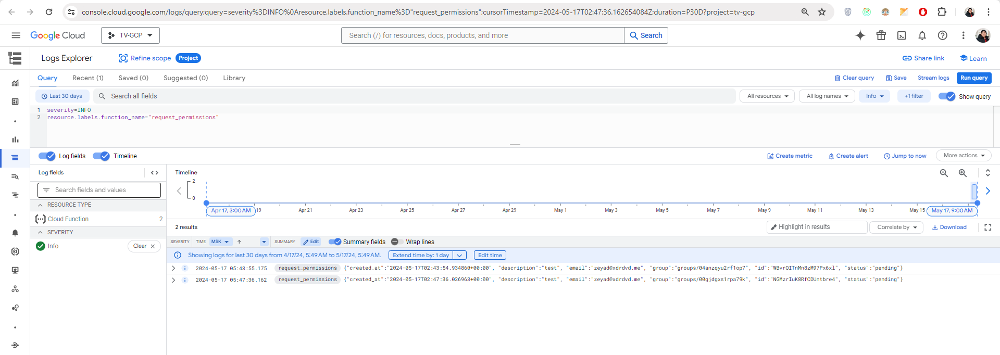
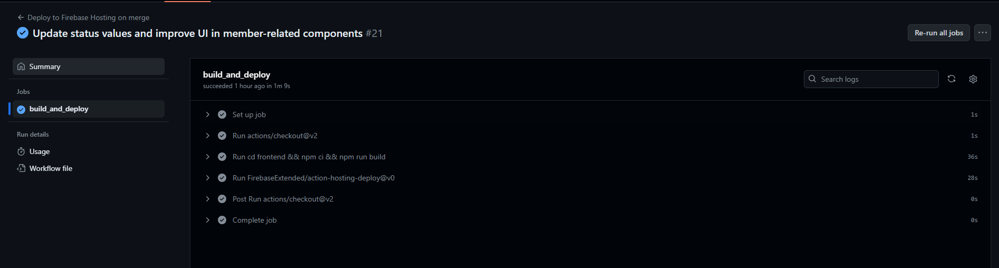
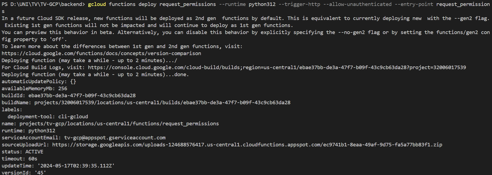

### Detailed Architecture and Workflow

#### Overview

The objective is to develop a routine that enables developers to request elevated permissions through a web application, utilizing native Google Cloud Platform (GCP) components. The architecture includes the following key components:

1. **Front-End Application**: Built using React, styled with Tailwind CSS and Material UI (MUI), and deployed via Docker.
2. **Backend Services**: Google Cloud Functions powered by Flask to handle API requests.
3. **Authentication**: Google Identity Platform for user authentication with Gmail.
4. **Logging and Auditing**: Google Cloud Logging for tracking permission requests.

### Architecture Diagram


### Workflow

#### User Authentication

1. **Login**:
   - Developers log in using their Gmail accounts via the Google Identity Platform.
   - The application checks the user's role (developer or super admin) and renders the appropriate view.

#### Permission Request

1. **Request Form**:
   - Developers access the web application and request elevated permissions by filling out a form with the desired group and a description of the request.
   - The form submission triggers a `POST` request to the backend API.

#### Backend Services

1. **Handling Requests**:

   - The backend API (Google Cloud Function) receives the request and logs the details (user email, description, timestamp) using Google Cloud Logging.
   - If the requester is an owner/manager of the super admin group, they can view and manage all requests. Otherwise, developers can only view their own requests.

2. **Endpoints**:
   - **Get Groups**:
     - `GET /groups`: Returns a list of groups and roles.
   - **Get Requests**:
     - `GET /requests`: Returns a list of permission requests. Access is filtered based on the user's role (developer or super admin).
   - **Post Request**:
     - `POST /requests`: Accepts a new permission request.
   - **Accept Request**:
     - `POST /accept?id=<request-id>`: Accepts a pending request.
   - **Reject Request**:
     - `POST /reject?id=<request-id>`: Rejects a pending request.

#### Logging and Auditing

1. **Logging Function**:
   - Google Cloud Logging is used to keep a detailed log of all actions.
   - The logging function writes log entries for each request and action taken.

```python
from google.cloud import logging

def write_entry(logger_name, entry):
    """Writes log entries to the given logger."""
    logging_client = logging.Client()

    # This log can be found in the Cloud Logging console under 'Custom Logs'.
    logger = logging_client.logger(logger_name)

    # Struct log. The struct can be any JSON-serializable dictionary.
    logger.log_struct(
        entry,
        severity="INFO",
    )
```

2. **Audit Logs**:

   - The log entries include the user's email, description of the request, and timestamp.
   - Actions such as request creation, acceptance, and rejection are logged for auditing purposes.
   - [Check the logs link](https://console.cloud.google.com/logs/query;duration=P30D;query=severity%3DINFO%0Aresource.labels.function_name%3D%22request_permissions%22?project=tv-gcp)

   

### Dockerization and Deployment

1. **Containerization**:

   - The front-end application is containerized using `Docker`, However, we have user the `CI/CD` of firebase to deploy since it is a static simple web app.

2. **Deployment**:
   - The front-end application is deployed to Firebase Hosting using the Firebase CLI.
   - The backend Google Cloud Functions are deployed using GCP's deployment tools.




### Team Contributions

1. **Front-End Development**:

   - Responsible: `Zeyad Alagamy`
   - Email: `z.alagamy@innopolis.univeristy`
   - Tasks: Developed the React application, integrated Tailwind CSS and MUI, implemented the login and home pages, assisted with `GCP API` integration, and reports.

2. **Backend Development**:

   - Responsible: `Ahmed Saber`
   - Email: `a.soliman@innopolis.univeristy`
   - Tasks: Developed the Flask API, implemented Google Cloud Functions, defined API endpoints, and set up the environment user groups and accounts, and demo video.
