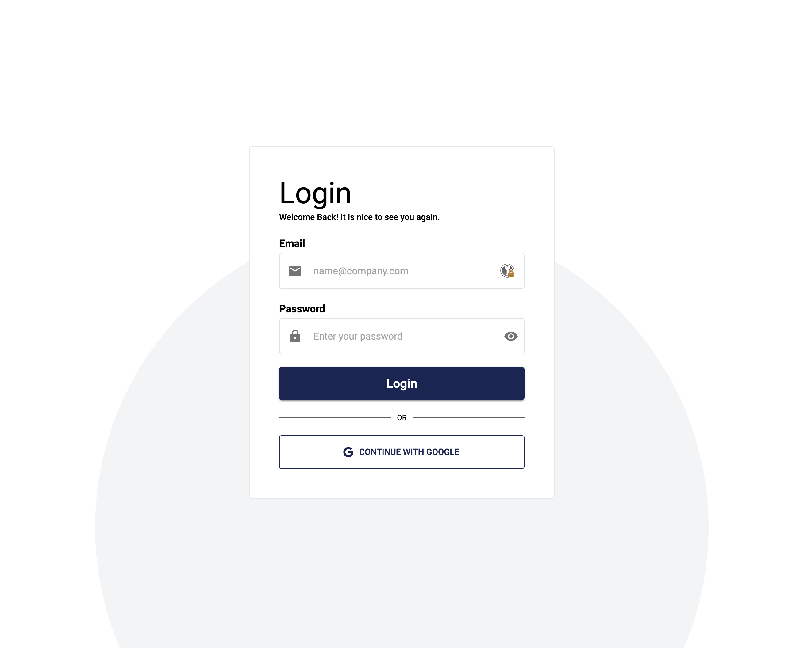

# User Guide

## Logging In

You have 2 options of logging in:

1. Using your Google account
2. Using your email and password

## Requesting Elevated Permissions

To request elevated permissions, you need to fill in the form on the main page.

TODO: add image

## Viewing Requests

TODO: add image

## Video Demonstration

TODO: add video
