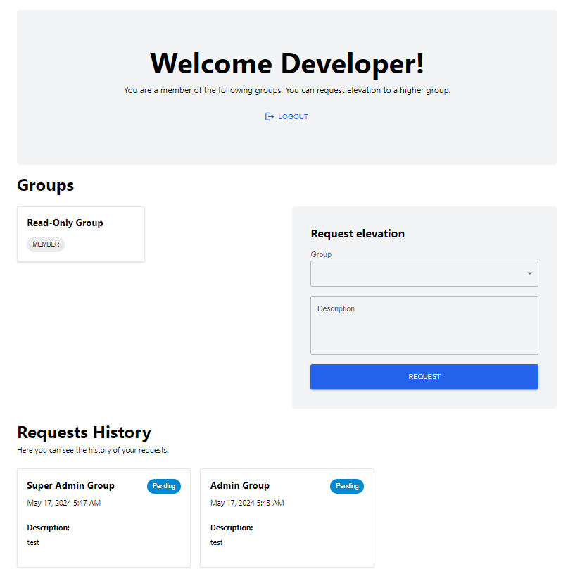

### User Guide

#### For Developers

1. **Log In**:

   - Visit the application [here](https://tv-gcp.web.app/).
   - Log in using your Gmail account, you should use the same account that you used to access the Google Cloud Platform. `someone@xdrdvd.md`

2. **Request Elevated Permissions**:

   - Navigate to the 'Request Permissions' section.
   - Select the group and provide a description for the request.
   - Submit the request.

3. **Track Requests**:

   - View the status of your requests in the 'Request History' section.

   

#### For Super Admins

1. **View Requests**:

   - Log in using your Gmail account, same account that you used to access the Google Cloud Platform. `someone@xdrdvd.md`.
   - Navigate to the 'Admin View' section.
   - Filter and view requests based on their status.

2. **Manage Requests**:
   - Accept or reject pending requests as necessary.
     
